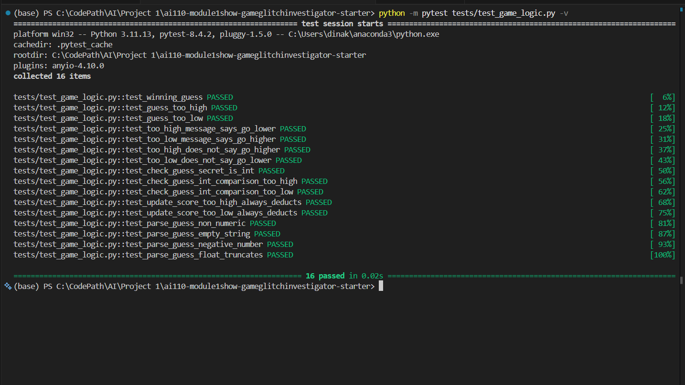
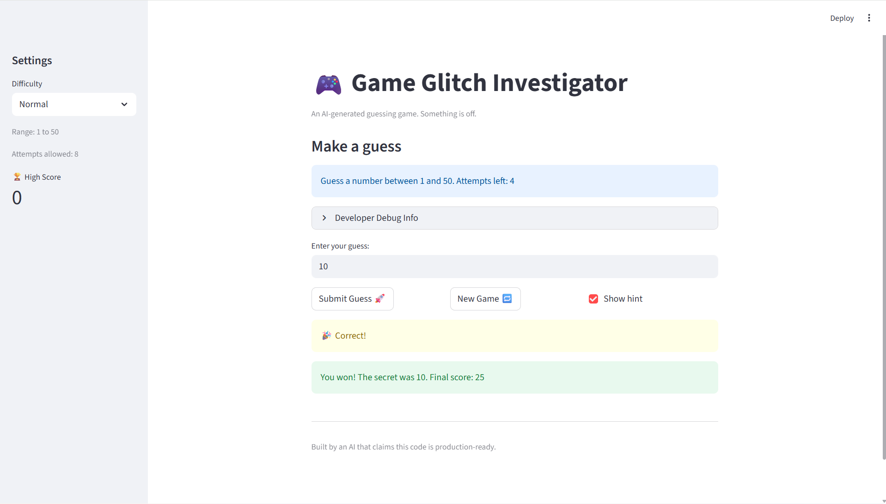

# 🎮 Game Glitch Investigator: The Impossible Guesser

## 🚨 The Situation

You asked an AI to build a simple "Number Guessing Game" using Streamlit.
It wrote the code, ran away, and now the game is unplayable. 

- You can't win.
- The hints lie to you.
- The secret number seems to have commitment issues.

## 🛠️ Setup

1. Install dependencies: `pip install -r requirements.txt`
2. Run the broken app: `python -m streamlit run app.py`

## 🕵️‍♂️ Your Mission

1. **Play the game.** Open the "Developer Debug Info" tab in the app to see the secret number. Try to win.
2. **Find the State Bug.** Why does the secret number change every time you click "Submit"? Ask ChatGPT: *"How do I keep a variable from resetting in Streamlit when I click a button?"*
3. **Fix the Logic.** The hints ("Higher/Lower") are wrong. Fix them.
4. **Refactor & Test.** - Move the logic into `logic_utils.py`.
   - Run `pytest` in your terminal.
   - Keep fixing until all tests pass!

## 📝 Document Your Experience

- [x] **Game purpose:** A number guessing game built with Streamlit. The player selects a difficulty (Easy: 1–20, Normal: 1–50, Hard: 1–100) and tries to guess a secret number within a limited number of attempts. Each guess is scored — points awarded for winning, deducted for wrong guesses.

- [x] **Bugs found:**
  1. **Hint type bug** — On even-numbered attempts, the secret was cast to `str`, causing alphabetical comparison instead of numeric (e.g. `"7" > "50"` is True alphabetically even though 7 < 50), producing completely wrong hints.
  2. **Reversed hint messages** — `check_guess` returned "Go HIGHER!" for a Too High guess and "Go LOWER!" for a Too Low guess — the opposite of what the player needs.
  3. **Difficulty range bug** — "Hard" returned range (1, 50), narrower than Normal (1–100), making Hard easier than Normal.
  4. **Score bug** — `update_score` rewarded +5 points for a wrong "Too High" guess on even-numbered attempts instead of deducting 5.
  5. **Frozen game after win/loss** — "New Game" reset attempts and secret but never reset `st.session_state.status`, so the next game hit `st.stop()` immediately.
  6. **New game ignored difficulty** — "New Game" hardcoded `random.randint(1, 100)` instead of using the selected difficulty range.
  7. **Info banner hardcoded range** — Always displayed "between 1 and 100" regardless of difficulty.

- [x] **Fixes applied:**
  - Removed the even/odd `str()` conversion — `check_guess` always receives an `int` secret.
  - Fixed hint messages: "Too High" → "📉 Go LOWER!", "Too Low" → "📈 Go HIGHER!".
  - Fixed difficulty ranges: Easy = 1–20, Normal = 1–50, Hard = 1–100.
  - Fixed `update_score` to always deduct 5 for wrong guesses, removing the even-attempt reward.
  - Added `st.session_state.status = "playing"` to the new game block so games are replayable.
  - Updated new game to use `random.randint(low, high)` from the selected difficulty.
  - Updated the info banner to `f"between {low} and {high}"`.
  - Refactored all game logic (`get_range_for_difficulty`, `parse_guess`, `check_guess`, `update_score`) from `app.py` into `logic_utils.py`.
  - Added a 🏆 High Score tracker in the sidebar (persists across games in the session).
  - Fixed and expanded `tests/test_game_logic.py` to 16 passing tests including edge cases.

## 📸 Pytest Results

- [x] [Insert a screenshot of all pytest tests passing here]

## 📸 Demo

- [x] [Insert a screenshot of your fixed, winning game here]

## 🚀 Stretch Features

- [ ] [If you choose to complete Challenge 4, insert a screenshot of your Enhanced Game UI here]
